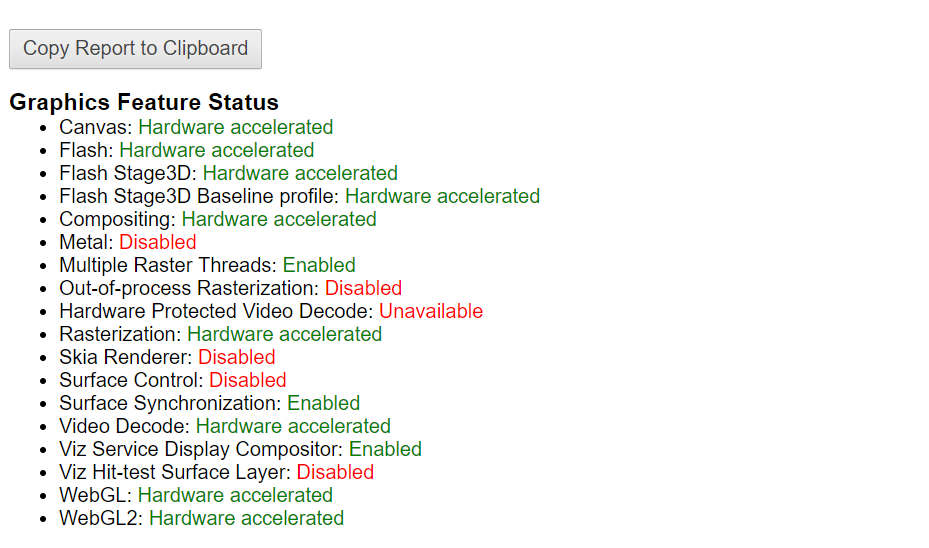
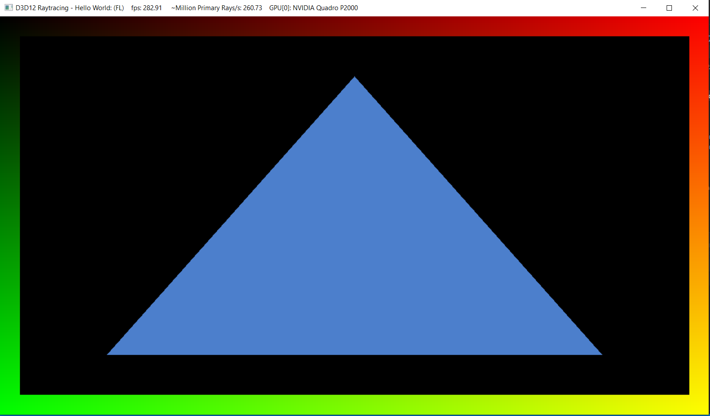
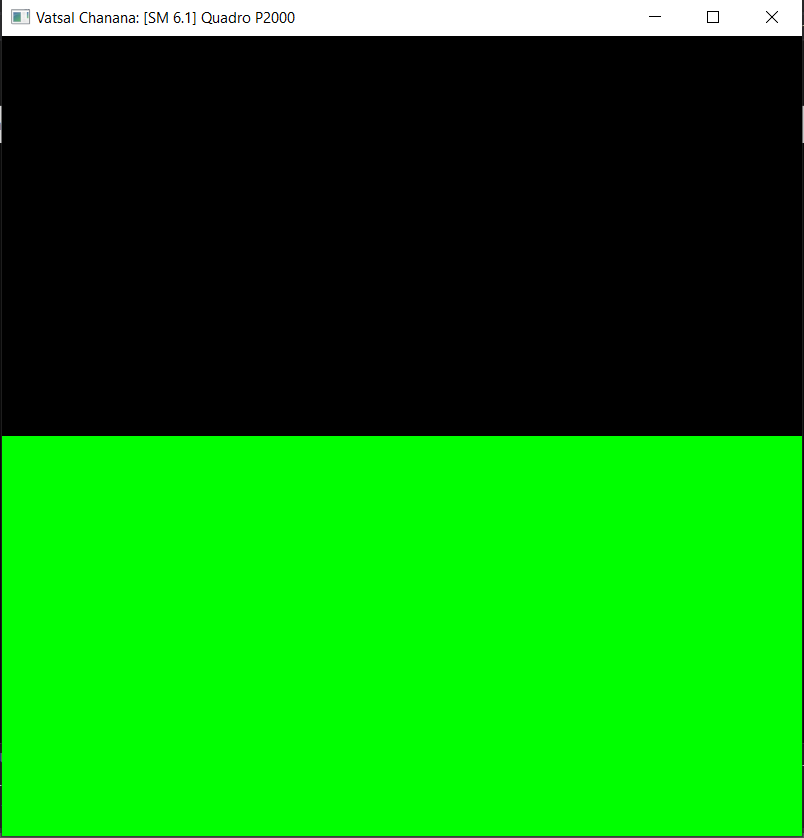
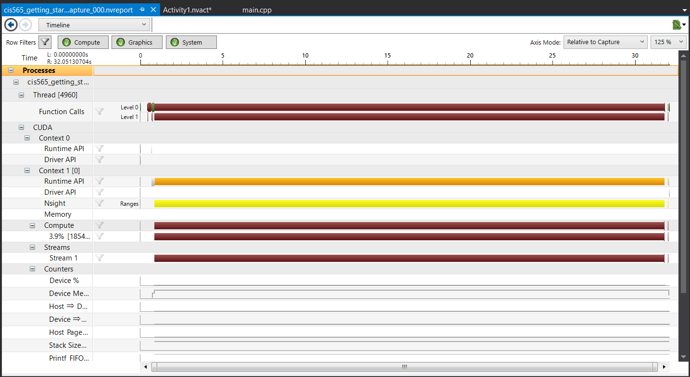
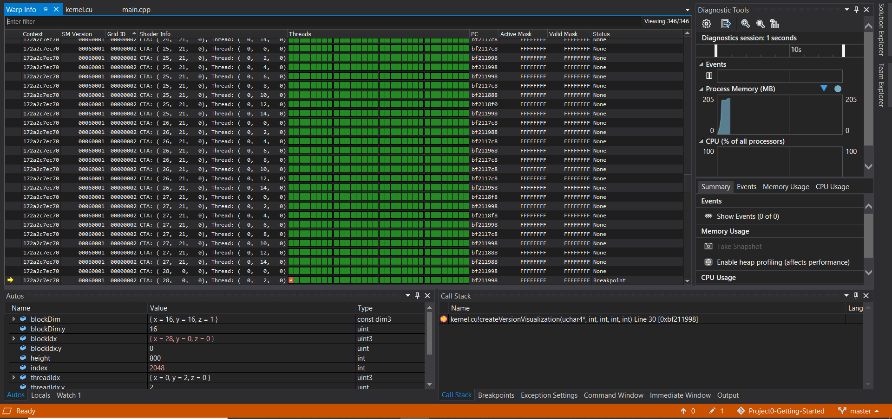

Project 0 Getting Started
====================

**University of Pennsylvania, CIS 565: GPU Programming and Architecture, Project 0**

* Vatsal Chanana
  *  [LinkedIn](https://www.linkedin.com/in/vatsal-chanana-27a137a1/), [personal website](www.seas.upenn.edu/~chanana), 
* Tested on: Windows 10, Intel Xeon E-2176M @ 2.70GHz 16GB, Quadro P2000 4GB
* Compute Capability of  CUDA-compatible GPU : 6.1

### Screenshots:

#### chrome://gpu - 

#### DXR -

#### CUDA Build Run -

#### Nsight Timeline -

#### Nsight Debugging -

